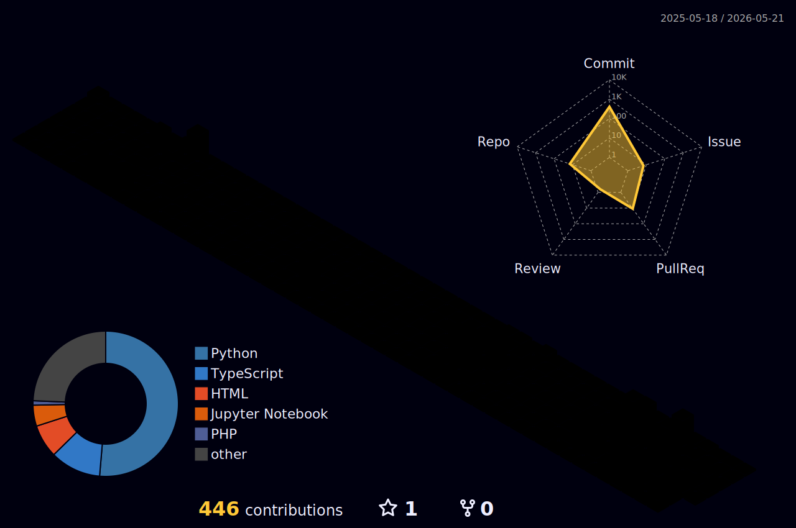

  

<h1 align="center">Hi 👋, I'm Prince Joshi</h1>
<h3 align="center">A passionate ML Developer from India</h3>

  

---

### 🚀 About Me
- 🔭 Currently building an **AI Virtual Assistant**
- 🌱 Actively learning **Generative AI, LLM systems & RAG**
- 👯 Open to collaborating on **AI / ML & data-driven projects**
- 💬 Ask me about **Deep Learning, Machine Learning, Python**
- 📫 Reach me at **princejoshij736@gmail.com**

---

### 🧠 Current AI Focus
- LLM orchestration & agent workflows  
- Retrieval-Augmented Generation (RAG)  
- Desktop AI agents (Electron + FastAPI)  
- Model optimization & inference pipelines  

---
<h3 align="left">Connect with me:</h3>

<!-- Social icons section -->

  
  &#8287;&#8287;&#8287;&#8287;&#8287;
  
  &#8287;&#8287;&#8287;&#8287;&#8287;
  
  &#8287;&#8287;&#8287;&#8287;&#8287;

---
<h3 align="left">🛠 Languages and Tools</h3>

Technologies I actively use across AI, ML, backend, and data engineering

<table>
  <tr>
    <td align="center" width="96">
       C
    </td>
    <td align="center" width="96">
       C++
    </td>
    <td align="center" width="96">
       Python
    </td>
    <td align="center" width="96">
       JavaScript
    </td>
    <td align="center" width="96">
       HTML
    </td>
    <td align="center" width="96">
       CSS
    </td>
    <td align="center" width="96">
       Git
    </td>
  </tr>

  <tr>
    <td align="center" width="96">
       Node.js
    </td>
    <td align="center" width="96">
       Express
    </td>
    <td align="center" width="96">
       MongoDB
    </td>
    <td align="center" width="96">
       MySQL
    </td>
    <td align="center" width="96">
       Docker
    </td>
    <td align="center" width="96">
       Airflow
    </td>
    <td align="center" width="96">
       FAISS
    </td>
  </tr>

  <tr>
    <td align="center" width="96">
       Pandas
    </td>
    <td align="center" width="96">
       PyTorch
    </td>
    <td align="center" width="96">
       Scikit-Learn
    </td>
    <td align="center" width="96">
       Seaborn
    </td>
    <td align="center" width="96">
       TensorFlow
    </td>
    <td align="center" width="96">
       LangChain
    </td>
    <td align="center" width="96">
      
         LangGraph
    </td>
  </tr>
</table>

---

## 📈 GitHub Activity & Contributions
 
<h3> 📊 GitHub 3D Contribution Graph</h3>

---

